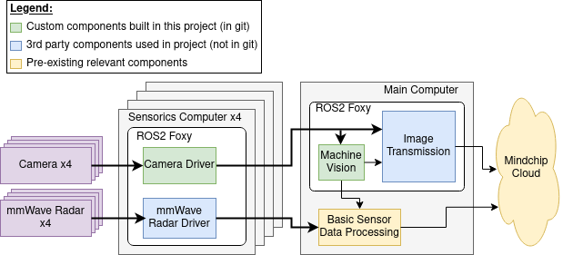

*This is a template repository for this organization. Start by replacing the placeholder for the project name with it's actual title.*

# Testing and validation of artificial captain algorithms and sensor fusion for autonomous robotic vessels

## Summary

| Company name | [MindChip OÜ](https://mindchip.ee/) |
| :--- | :--- |
| Development Team Lead Name | [Karl Janson](https://www.etis.ee/CV/Karl_Janson/eng/) |
| Development Team Lead e-mail | [karl.janson@taltech.ee](mailto:karl.janson@taltech.ee) |
| Objectives of the Demonstration Project | Development artificial capten system for autonomous ships |

## Objectives of the Demonstration Project
The ultimate goal of the project is to develop artificial capten:
1) Collecting data from the surroundings for training
2) Machine vision and tracking development and training on previously collected data
3) Simple sensor fusion
4) Transferring data to server
5) Testing at sea

## Activities and results of demonstration project
*Challenge addressed (i.e. whether and how the initial challenge was changed during the project, for which investment the demonstration project was provided)*

Building the system to the point where it was suitable for data collection took more time that anticipated. This resulted in a couple of changes:
* Machine vision model could not be trained on collected data before the end of the project. Current model is trained on data from the internet. This will be done in the follow-up project.
* MindChip developed simple sensor data processing algorithms themselves to help us move forward faster. This will be considerably improved on in the follow-up project.

*Data sources (which data was used for the technological solution)*

The dataset used for training is available here:
https://app.roboflow.com/emptyws/tmp-msi0f/2

It was compiled from varios other online sources, mainly from the following:
* https://universe.roboflow.com/wilson_xu_weixuan-outlook-com/marvel-single
* https://universe.roboflow.com/shipclassification/shipclassification
* https://universe.roboflow.com/wuhan-university-of-technology-tkmnj/different-types-
* of-light-buoys
* https://universe.roboflow.com/yolo-project/buoy

*Description and justifictaion of used AI technology*

AI is used for machine vision to detect other objects, such as vessels and buoys. This is needed for safe navigation of the autonomous ship. In the custom collected data, there are also annotated harbor quays, however they are not in the training data that was used for creating the current model.

The machine vision is done using four cameras, each looking in different direction and processes the images in round-robin fashion. The algorithm we chose is YOLOv5m. We compared different algorithms and this was the one with best performance tradeoffs (in terms of speed vs accuracy). The model has 1280x1280 pixel input. This large input is needed, since objects on sea can be far away an appear rather small, higher resolution model can detect smaller objects in the image and therefore objects that are farther away. This is also reason why we chose YOLOv5 over newer YOLOv8. YOLOv8 only has lower resolution models and YOLOv5 outperformed it in our tests.

*Results of testing and validating technological solution*

The AI model was trained to detect other shps and buoys on the sea. Tests on sea show that our model can consistently detect small boats starting from distance of 100 to 150 m. Larger ships can be detected from even farther away, depending the size of the ship and weather. All tests were performed during daytime
with no significant precipitation. In general, the perforemance for detecting ships is better than we initially expected.

The buoy detection suffers from the fact that there were no Estonian buoys in the initial training dataset. Detection accuracy is currently around 20 to 25 %. During the project a an extensive dataset was collected and annotated, which will improve the buoy detection performance of the model considerably.

*Technical architecture (presented graphically, where can also be seen how the technical solution integrates with the existing system)*

*Potential areas of use of technical solution*

The solutions created in this project can be used in wide range of tasks where machine vision and image processing are required on a device running the Robot Operating System (ROS). Some examples include different land and sea-based robots, also smart city applications, such as traffic monitoring, different smart sensors

*Lessons learned (i.e. assessment whether the technological solution actually solved the initial challenge)*

The main lesson learned was to never underestimate the “simple” tasks. As mentioned before, it took much longer to get the cameras and image transmission and recording systems working reliably than initially anticipated. Because for data collection working cameras were a requirement, the data collection phase was pushed back by some time.

### Description of User Interface 
*(i.e. How does the client 'see' the technical result, whether a separate user interface was developed, command line script was developed, was it validated as an experiment, can the results be seen in ERP or are they integrated into work process)*

Images from cameras are transmitted to MindChip’s server. The operator of the autonomous ship can see them through MindChip’s operator interface. It is possible to see raw images from cameras and optionally also the objects that are detected by machine vision (the objects are annotated on camera images as using boxes). Additionally, the user can “see” the work done during this project when the ship stops because it detects a potentially dangerous object.

## Custom agreement with the AIRE team

*If you have a unique project or specific requirements that don't fit neatly into the Docker file or description template options, we welcome custom agreements with our AIRE team. This option allows flexibility in collaborating with us to ensure your project's needs are met effectively.*

*To explore this option, please contact our demonstration projects service manager via katre.eljas@taltech.ee with the subject line "Demonstration Project Custom Agreement Request - [Your Project Name]." In your email, briefly describe your project and your specific documentation or collaboration needs. Our team will promptly respond to initiate a conversation about tailoring a solution that aligns with your project goals.*

